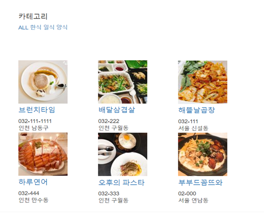

# 배달의민족 카피 프로젝트 (웹버전)

- django로 배달의민족 서비스를 웹버전으로 카피하여, 그룹별 회원관리, 메뉴등록, 주문기능을 구현한 프로젝트입니다.

 

- index 페이지

---

 

- client(고객용) 주문 페이지

  
[데모 홈페이지(이동)](http://baeminsite-dev.ap-northeast-2.elasticbeanstalk.com/)

---
 

## 개발환경

 - Python 3.6 / Django 1.10.4
 
 - Virtualenv로 가상환경 설정
 
 - AWS elastic beanstalk 배포 설정
 
 - PostgreSQL 연결 설정
 
 - django-storages로 Amazon S3 연결 설정 

 

## 주요 기능
- partner/client 그룹별 회원가입/로그인/로그아웃 구현

- partner일 경우 업체 정보와 메뉴 추가/수정/삭제 기능

- client일 경우 메뉴 주문 기능

- @user_passes_test와 @login_required로 접근 제한 설정

- is_active 필드로 관리자 승인 이후 업체가 고객에게 노출되도록 설정

- templatestags 커스텀하여 그룹별로 네비게이션바가 다르게 나타나도록 적용

 

## 배포
- AWS elastic beanstalk과 postgresSQL로 배포

- Amazon S3 연동으로 이미지 파일 관리

